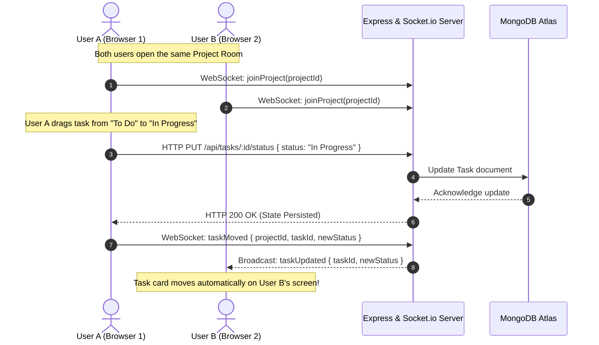

<div align="center">

  # ⚡ Nexus — Real-Time Project Management Platform
  
  **A futuristic, collaborative Kanban board powered by Node.js, Express, MongoDB Atlas, and Socket.io.**
  
  <p align="center">
    <i>Built with precision, high-performance architecture, and a modern glassmorphic UI as part of the CodeAlpha Internship.</i>
  </p>

  <!-- Primary Action Badges -->
  <p align="center">
    <a href="https://code-alpha-nexus-laqo.vercel.app" target="_blank">
      
    </a>
    <a href="https://www.youtube.com" target="_blank">
      
    </a>
    <a href="https://www.linkedin.com/posts/your-linkedin-video-link" target="_blank">
      
    </a>
    <a href="https://www.linkedin.com/in/kabir-soomro" target="_blank">
      
    </a>
  </p>

  <!-- Tech Stack Badges -->
  <p align="center">
    
    
    
    
    
    
    
  </p>

</div>

---

## 📌 Table of Contents
- [Live Application Access](#-live-application-access)
- [Project Overview](#-project-overview)
- [Key Features](#-key-features)
- [System Architecture & Data Flow](#-system-architecture--data-flow)
- [Tech Stack](#-tech-stack)
- [API Documentation](#-api-documentation)
- [Folder Structure](#-folder-structure)
- [Getting Started & Local Setup](#-getting-started--local-setup)
- [Database Configuration (MongoDB Atlas)](#-database-configuration-mongodb-atlas)
- [Author & Acknowledgments](#-author--acknowledgments)

---

## 🌐 Live Application Access

Click below to test the full Kanban workspace live in your browser:

| Resource | Platform | Status | Direct Link |
| :--- | :--- | :--- | :--- |
| **Live Web App** | **Vercel** |  | [https://code-alpha-nexus-laqo.vercel.app](https://code-alpha-nexus-laqo.vercel.app) |
| **Source Repository** | **GitHub** |  | [KabirSoomro/CodeAlpha_Nexus](https://github.com/KabirSoomro/CodeAlpha_Nexus) |

> 💡 **Instant Access:** Click the **[Live Web App](https://code-alpha-nexus-laqo.vercel.app)** link above to test instant signup, project creation, task management, and drag-and-drop Kanban synchronization in real-time.

---

## 🚀 Project Overview

**Nexus** is an end-to-end full-stack agile project management tool. It empowers individuals and teams to organize workflows, monitor task progression through intuitive Kanban columns, and collaborate across multiple browser sessions with zero latency using WebSockets.

Designed with a state-of-the-art **Glassmorphism Dark Theme**, animated background aura blobs, and micro-interactions, Nexus delivers an executive desktop-grade user experience while maintaining robust server-side security, token validation, and fault-tolerant cloud database clustering.

---

## ✨ Key Features

### 🔄 1. Instant Real-Time Collaboration (Socket.io)
- Multi-client real-time synchronization: Move a task card in one window, and it immediately transitions in all other connected client screens without reloading.
- Isolated project rooms (`joinProject`) to ensure updates are broadcast strictly to relevant project collaborators.

### 📋 2. Interactive Drag-and-Drop Kanban Board
- Fluid HTML5 Drag-and-Drop functionality across three agile stages: **To Do**, **In Progress**, and **Done**.
- Automatic persistence: Moving a card immediately invokes backend state updates via REST API while notifying peers via WebSockets.

### 🛡️ 3. Smart Contextual Authentication & Feedback
- Secure JWT (JSON Web Token) authentication with `bcrypt` salt rounds for password hashing.
- **Context-Aware Validation**:
  - Unregistered Email ➔ Inline warning: `⚠️ No account registered with this email.`
  - Registered Email + Wrong Password ➔ Inline confirmation: `✓ Account found with this email` coupled with `⚠️ Incorrect password!`.
- Live input listener automatically resets error states as soon as the user starts typing.
- Automated server reconnection loop that gracefully recovers from network drops.

### 📁 4. Multi-Workspace & Project Hierarchy
- Create, manage, and toggle between separate project environments.
- Per-project task filtering, ensuring zero data bleed between client workspaces.

### 🎯 5. Task Attributes, Priority Tags & Live Search
- Granular task configuration: Title, Description, Priority (**High [Red]**, **Medium [Yellow]**, **Low [Blue]**), and Due Date tracking.
- Instant keyword filtering: Search tasks dynamically across all columns in real-time.
- One-click bulk clear for completed tasks.

---

## 🏗️ System Architecture & Data Flow



---

## 🛠️ Tech Stack

| Domain | Technology | Purpose |
| :--- | :--- | :--- |
| **Frontend UI** | HTML5, CSS3 Glassmorphism | Responsive semantic layouts, custom backdrop filters, animated aura blobs |
| **Frontend Logic** | Vanilla JavaScript (ES6+) | DOM orchestration, Drag-and-Drop API, Fetch API, Socket.io Client |
| **Typography & Icons**| Google Fonts (Outfit), FontAwesome 6 | High-contrast modern typography and scalable vector iconography |
| **Backend Framework**| Node.js & Express.js | Scalable REST API architecture and static asset delivery |
| **Database** | MongoDB Atlas & Mongoose | Cloud NoSQL database with schema modeling, indexes, and auto-reconnect |
| **Real-Time Layer** | Socket.io | Bidirectional WebSocket communication for instant state sync |
| **Security** | JWT (jsonwebtoken), Bcrypt | Stateless session tokens and salted password hashing |

---

## 📡 API Documentation

### 🔐 Authentication Routes (`/api/auth`)
| Method | Endpoint | Description | Access |
| :--- | :--- | :--- | :--- |
| `POST` | `/api/auth/register` | Register a new user account | Public |
| `POST` | `/api/auth/login` | Authenticate user & receive JWT token | Public |

### 📁 Project Routes (`/api/projects`)
| Method | Endpoint | Description | Access |
| :--- | :--- | :--- | :--- |
| `GET` | `/api/projects` | Retrieve all projects for authenticated user | Private (Bearer Token) |
| `POST` | `/api/projects` | Create a new project workspace | Private (Bearer Token) |
| `DELETE` | `/api/projects/:id` | Delete a project and associated tasks | Private (Bearer Token) |

### 📝 Task Routes (`/api/tasks`)
| Method | Endpoint | Description | Access |
| :--- | :--- | :--- | :--- |
| `GET` | `/api/tasks/project/:projectId` | Fetch all tasks belonging to a project | Private (Bearer Token) |
| `POST` | `/api/tasks` | Create a new task in a project | Private (Bearer Token) |
| `PUT` | `/api/tasks/:id/status` | Update task column status (Drag & Drop) | Private (Bearer Token) |
| `PUT` | `/api/tasks/:id` | Edit task details (title, priority, deadline) | Private (Bearer Token) |
| `DELETE` | `/api/tasks/:id` | Permanently delete a task | Private (Bearer Token) |
| `DELETE`| `/api/tasks/project/:projectId/done` | Clear all tasks marked as "Done" | Private (Bearer Token) |

---

## 📂 Folder Structure

```bash
CodeAlpha_ProjectManagement/
├── backend/
│   ├── config/
│   │   └── db.js               # MongoDB connection & auto-reconnection loop
│   ├── controllers/
│   │   ├── authController.js   # User registration, login & validation logic
│   │   ├── projectController.js# Workspace & Project CRUD operations
│   │   └── taskController.js   # Task lifecycle, status updates & cleanup
│   ├── middleware/
│   │   └── authMiddleware.js   # JWT token verification & database readiness
│   ├── models/
│   │   ├── Project.js          # Project schema & user reference
│   │   ├── Task.js             # Task schema (title, status, priority, dates)
│   │   └── User.js             # User schema with bcrypt pre-save hash hooks
│   ├── routes/
│   │   ├── authRoutes.js       # Auth API route definitions
│   │   ├── projectRoutes.js    # Project API route definitions
│   │   └── taskRoutes.js       # Task API route definitions
│   └── server.js               # Express app, HTTP server & Socket.io setup
├── frontend/
│   ├── index.html              # Futuristic login & signup portal
│   ├── dashboard.html          # Main workspace & Kanban board view
│   └── public/
│       ├── css/
│       │   ├── style.css       # Core design tokens, glassmorphism & animations
│       │   └── board.css       # Kanban columns, cards, modals & status tags
│       └── js/
│           ├── app.js          # Authentication helpers & global state
│           ├── auth.js         # Reactive form validation & feedback handlers
│           ├── board.js        # Kanban board controller & drag-drop logic
│           └── socket-client.js# WebSocket room management & incoming events
├── .env                        # Environment variables (PORT, MONGO_URI, JWT_SECRET)
├── package.json                # Project dependencies and scripts
└── README.md                   # Complete project documentation
```

---

## 💻 Getting Started & Local Setup

### Prerequisites
- [Node.js](https://nodejs.org/) (version 16.x or higher)
- [Git](https://git-scm.com/)
- A free [MongoDB Atlas](https://cloud.mongodb.com/) cluster or local MongoDB instance

### 1. Clone the Repository
```bash
git clone https://github.com/your-username/CodeAlpha_ProjectManagement.git
cd CodeAlpha_ProjectManagement
```

### 2. Install Dependencies
```bash
npm install
```

### 3. Configure Environment Variables
Create a `.env` file in the root directory:
```env
PORT=5000
MONGO_URI=your_mongodb_connection_string
JWT_SECRET=your_super_secret_jwt_key
```

### 4. Run the Application
```bash
npm start
```
The server will boot up and be accessible at:
```
http://localhost:5000
```

---

## 🌐 Database Configuration (MongoDB Atlas)

To allow seamless access across all devices and evaluators:
1. Log in to [MongoDB Atlas](https://cloud.mongodb.com/).
2. Navigate to **Security** ➔ **Network Access**.
3. Click **Add IP Address** ➔ Select **Allow Access from Anywhere** (`0.0.0.0/0`).
4. Ensure the temporary toggle is turned **OFF** so access remains permanent.
5. Click **Confirm**.

---

## 👨‍💻 Author & Acknowledgments

- **Developer**: Kabir Soomro
- **Organization**: [CodeAlpha](https://www.codealpha.tech/) (Full Stack Web Development Internship)
- **LinkedIn**: [Kabir Soomro](https://www.linkedin.com/in/kabir-soomro)
- **License**: This project is licensed under the [ISC License](LICENSE).

<div align="center">
  <sub>Built with ❤️ by Kabir Soomro for CodeAlpha. If you find this project helpful, feel free to star ⭐ the repository!</sub>
</div>
